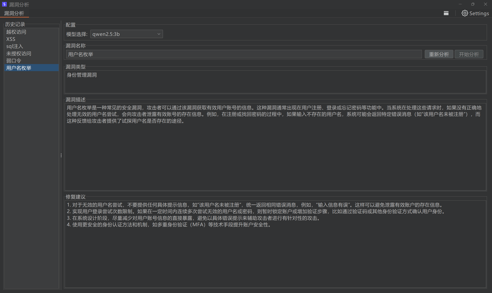

# 🛡️ VulFix-Ollama  

  

  
  
  

_🤖 让漏洞修复建议生成更简单_  

  

## ⭐️ 项目介绍  

VulFix-Ollama 是一款专为渗透测试工程师打造的 Burp Suite 插件。它通过本地部署的 Ollama AI 模型，帮助您快速生成专业、规范的漏洞修复建议，让报告编写事半功倍。  

### 🌟 核心优势  

- 🏃‍♂️ **便捷高效** - 一键生成修复建议，告别重复输入  
- 🔒 **数据安全** - 本地部署 AI 模型，数据绝不外传  
- 🎯 **专业规范** - 生成符合行业标准的修复方案  
- 📦 **开箱即用** - 简单安装，无需复杂配置  
- 💾 **历史记录** - 保存常用建议，随时快速调用  

## 🚀 快速开始  

### 环境要求  

- ✅ Java 8 或更高版本  
- ✅ Burp Suite Professional/Community  
- ✅ Ollama 本地服务  

### 📥 安装步骤  

1. 下载 `vulfix-ollama.jar`  
2. 启动 Burp Suite  
3. 转到 `Extender` → `Extensions`  
4. 点击 `Add` 添加插件  
5. 确保 Ollama 服务运行在默认端口 (11434)  

### 💡 使用指南  

1. 切换到插件标签页  
2. 选择合适的 AI 模型  
3. 输入漏洞名称或描述  
4. 点击生成按钮  
5. 获取专业的修复建议  

## 📝 使用示例  

  

点击查看界面预览
  

  

  

## ⚠️ 注意事项  

- 首次使用请确保 Ollama 服务正常运行  
- 建议使用最新版本的 AI 模型以获得更好的效果  
- 本项目仅提供编译后的 jar 文件，源代码暂不开放  

---  

  
<i>让我们一起让渗透测试报告编写变得更轻松！</i>  

